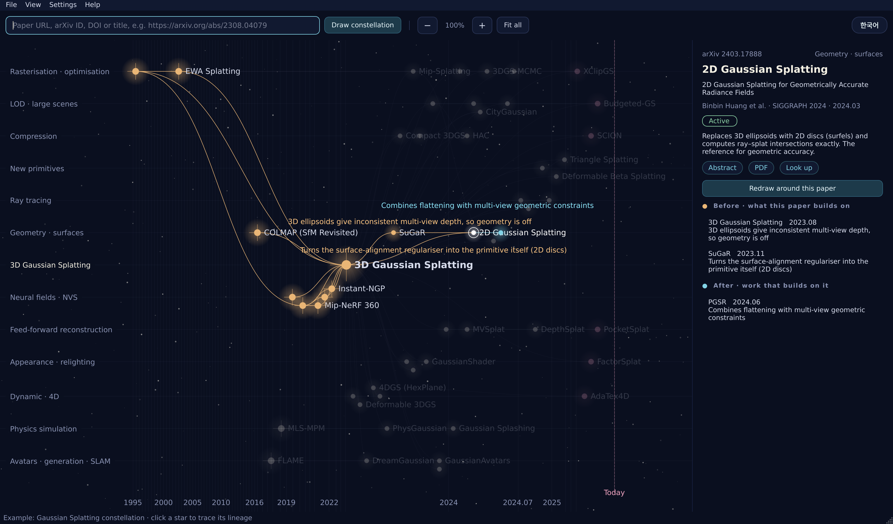
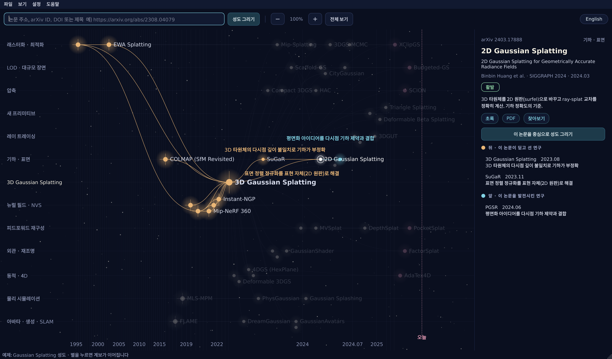

# Paper Constellation

**See where a paper came from and where it went, drawn as a star chart.**

**논문 한 편이 어디서 왔고 어디로 가고 있는지를 별자리로 보여 주는 데스크톱 앱.**

[English](#english) · [한국어](#한국어)



*The bundled Gaussian Splatting constellation with 2D Gaussian Splatting selected. Its predecessors light up in amber, its follow-ups in cyan, and each link says what the later paper solved. The interface switches between English and Korean with one button.*

---

## English

### Why

When you read a paper, three questions come up quickly:

- What problem was this paper trying to solve, and what came before it?
- How has the idea developed since then?
- Is it still an active line of work, or has something else replaced it?

Citation-graph tools exist, but most of them show who cited whom as hundreds of dots.
Paper Constellation keeps only the papers that are a **methodological step** in the lineage,
places them on a **time axis**, and labels each link with **what the later paper solved**.

```
NeRF  ──(replaces slow ray marching with sorted rasterisation)──▶  3D Gaussian Splatting
3DGS  ──(3D ellipsoids give inconsistent multi-view depth)──────▶  2D Gaussian Splatting
```

### Features

- **Paste anything that identifies a paper**: arXiv / alphaXiv URL or ID, DOI or a publisher page that contains one (ACM, IEEE, Springer, Wiley), Semantic Scholar URL, OpenReview URL, ACL Anthology URL, or just the title.
- **Time runs left to right.** Predecessors sit on the left, follow-ups on the right, and a dashed line marks today. The axis blends linear time with rank order, so one 1995 classic does not squeeze the busy recent years into a corner.
- **Research branches are rows**, such as compression, dynamic/4D or ray tracing. Without an LLM, the rows are simply predecessors, center and follow-ups.
- **Click a star to trace its lineage.** Everything it builds on lights up in amber and everything that grew from it in cyan. The links next to it show what each step solved.
- **Zoom and pan freely**: pinch on a trackpad, use the mouse wheel, the **−/+** buttons or keyboard shortcuts. Stars and labels keep their size while the map zooms, and labels that would overlap are hidden until there is room.
- **Double-click a star** (or use the panel button) to redraw the constellation around that paper.
- **Side panel**: authors, venue, date, status (*foundation · active · superseded · recent*), key idea, links to the abstract, PDF and Semantic Scholar, and the list of papers before and after with the problem each one solved.
- **Citation trend** for the center paper: citations per half-year, plus a verdict (*accelerating · steady · slowing*, or *just taking off* for young papers).
- **Optional LLM pass**: with an Anthropic API key, Claude reads the abstracts and citation sentences, drops incidental citations, writes the "what it solved" line for each link, groups papers into named branches, and summarises where the center paper stands today.
- **Save and open constellations** as plain JSON, so they are easy to edit by hand or generate with other tools.
- **English and Korean interface**: the **한국어 / English** button at the top right (or **View → language**, `Ctrl/Cmd+L`) switches every menu, message and panel instantly, keeping the current zoom and selection. The choice is remembered; on first launch the app follows the system language. The curated example ships with text in both languages, and the LLM writes its explanations in the language that is active when you draw.
- **Curated example included**: a Gaussian Splatting constellation with 53 papers and 69 annotated links opens on first launch.

### Installation

Requirements: Python 3.9 or newer, pip 21.3 or newer (needed for editable installs).

```bash
git clone https://github.com/<you>/paper-constellation.git
cd paper-constellation
python3 -m venv .venv
source .venv/bin/activate          # Windows: .venv\Scripts\activate
python -m pip install --upgrade pip
pip install -e .
```

Troubleshooting:

- **`File "setup.py" or "setup.cfg" not found`**: your pip is older than 21.3. Run `python -m pip install --upgrade pip` and try again.
- **`SyntaxError ... __init__.tmpl.py` followed by `encode() argument 'encoding' must be str`** while installing PySide6. This happens with the Python 3.9 that ships with Xcode on macOS. Either install with `pip install --no-compile -e .`, or create the virtual environment from a newer Python (for example conda: `"$CONDA_PREFIX/bin/python" -m venv .venv`).

### Usage

```bash
paper-constellation                                     # open the app
paper-constellation https://arxiv.org/abs/2212.09748    # open and draw this paper right away
python -m paper_constellation                           # same as the first line
```

1. Paste a paper address into the search bar and press **Enter** (or **Draw constellation / 성도 그리기**). The status bar shows progress; a first run takes roughly 15–30 seconds because of API rate limits. Repeat searches are served from a local cache.
2. **Explore** the chart:

   | Action | Result |
   |---|---|
   | Click a star | Highlight its lineage, show details in the side panel |
   | Double-click a star | Redraw the constellation around that paper |
   | Click empty sky / `Esc` | Clear the selection, show the overview |
   | Trackpad pinch, mouse wheel, or `Ctrl/Cmd` + scroll | Zoom around the pointer |
   | **−** / **+** buttons, `Ctrl/Cmd -` / `Ctrl/Cmd +`, or `-` / `+` | Zoom out / in (the toolbar shows the zoom level) |
   | Two-finger trackpad scroll, or drag | Pan |
   | **Fit all / 전체 보기**, `Ctrl/Cmd 0` | Fit the whole constellation to the window (100%) |
   | Hover a star or link | Full title / what the link solved |
   | **한국어 / English** button, `Ctrl/Cmd+L` | Switch the interface language |

3. **File → Save / Open** (`Ctrl/Cmd+S`, `Ctrl/Cmd+O`) stores a constellation as JSON. **File → Examples** reopens the bundled Gaussian Splatting constellation.

### How papers are selected

1. Fetch the center paper's references and citations from [Semantic Scholar](https://www.semanticscholar.org/product/api).
2. Score every link by: influential citation (`isInfluential`), methodology intent, number of citation contexts, and citation counts. Young follow-ups get a bonus so recent work is not drowned out.
3. Keep the top 12 predecessors and 16 follow-ups, then go one step further back from (and forward from) the strongest five of each.
4. Check citations among all selected papers, and remove a link when a longer path already connects the two papers (the center paper keeps all of its direct links).
5. *(Optional)* LLM pass, described above.

Without an API key, steps 1–4 still produce a constellation; links simply carry no explanation.

### Configuration

Use **Settings → API keys and model** in the app, or environment variables:

| Setting | Environment variable | Needed? |
|---|---|---|
| Semantic Scholar API key | `S2_API_KEY` | Optional. Without it the shared public rate limit applies and busy periods can be slow. [Request a key](https://www.semanticscholar.org/product/api#api-key-form). |
| Anthropic API key | `ANTHROPIC_API_KEY` | Optional. Enables link explanations, branches, statuses and the summary. Each constellation costs a small amount of API usage. |
| Model | `PC_MODEL` | Defaults to `claude-sonnet-5-5`. |
| Interface language | `PC_LANG` (`ko` or `en`) | Optional. Overrides the saved choice for one run. |

Keys typed into the settings dialog are stored **in plain text** in the app's settings file (Qt `QSettings`). On a shared computer, prefer environment variables.
API responses are cached for 7 days in `~/.cache/paper-constellation/`.

### File format

A constellation is one JSON file with `"schema": "paper-constellation/1"`:

- `nodes`: papers (`id`, `title`, `label`, `year`, `lane`, `kind`, `status`, `note`, …)
- Optional English translations for text written in another language: `title_en`, `summary_en`, `lanes[].name_en`, `nodes[].note_en`, `edges[].solves_en`
- `edges`: `src` is the earlier paper, `dst` the paper that builds on it, `solves` the problem `dst` solved
- `lanes`: research branches, in display order

See `src/paper_constellation/examples/gaussian-splatting.json`.

### Contributing

The value of this tool is the accuracy of its links. Especially welcome:

- **Curated constellations** for fields you know well (diffusion models, LLMs, reinforcement learning, physics simulation, …), added to `src/paper_constellation/examples/` and registered in `examples/__init__.py`.
- **Corrections** to links or `solves` text in the existing examples.
- **More data sources**, such as OpenAlex, by implementing the `s2.PaperSource` protocol.
- **More interface languages**: add a language code to `i18n.LANGUAGES` and a translation to every entry in `i18n.STRINGS` (a test checks that none is missing).

```bash
pip install -e ".[dev]"
pytest                                   # runs offline against tests/fake_source.py
PC_LANG=en QT_QPA_PLATFORM=offscreen QT_SCALE_FACTOR=2 python docs/capture_preview.py   # regenerate docs/preview-en.png (ko: docs/preview.png)
```

### Limitations

- Citation data comes from Semantic Scholar. Very recent papers may not have citation data yet.
- Statuses such as *superseded* and the "what it solved" lines come from an LLM reading abstracts. Treat them as a starting point and check the papers themselves.

### License

Paper Constellation is licensed under the **Apache License, Version 2.0**. See [LICENSE](LICENSE) and [NOTICE](NOTICE).

In short, you may use, modify and redistribute the code, including commercially, as long as you keep the license and copyright notices, state significant changes you made, and include the NOTICE file in redistributions. The license includes an express patent grant and comes with no warranty. The full LICENSE text is what applies.

Third-party components and data:

- **PySide6 / Qt for Python** is a dependency installed from PyPI and is licensed under the **LGPL v3** (or a commercial Qt license). It is not bundled in this repository. If you distribute a frozen app that bundles PySide6, follow the LGPL's requirements.
- **Citation data** is retrieved at run time from the [Semantic Scholar API](https://www.semanticscholar.org/product/api) (Allen Institute for AI) and is subject to its API license terms. Please keep the attribution.
- **LLM output** is generated through the Anthropic API under your own account and is subject to Anthropic's terms.
- **Bundled example** (`gaussian-splatting.json`): paper titles, authors and dates are bibliographic facts. The selection of papers, the links, and the explanatory notes are original work distributed under Apache-2.0 with this repository.

---

## 한국어



*번들 예제인 Gaussian Splatting 성도에서 2D Gaussian Splatting을 선택한 모습. 선행 계보는 주황, 후속 계보는 하늘색으로 이어지고, 연결선마다 후속 논문이 해결한 문제가 적혀 있습니다.*

### 왜 만들었나

논문을 읽다 보면 이런 질문이 생깁니다.

- 이 논문은 어떤 문제를 풀려고 나왔지? 그 전에는 뭐가 있었지?
- 그래서 이후에 어떻게 발전되고 있는데?
- 지금도 활발한 흐름이야, 아니면 이미 다른 방법으로 대체됐어?

인용 그래프 도구는 이미 많지만, 대부분 "누가 누구를 인용했나"를 수백 개의 점으로 보여 줍니다.
Paper Constellation은 **방법론적으로 직접 이어진 논문만** 골라 **시간축** 위에 놓고,
연결선마다 **"무엇을 해결했나"** 를 적어 둡니다.

```
NeRF  ──(느린 광선 행진 렌더링을 정렬 래스터화로 대체)──▶  3D Gaussian Splatting
3DGS  ──(3D 타원체의 다시점 깊이 불일치로 기하가 부정확)──▶  2D Gaussian Splatting
```

### 특징

- **논문을 가리키는 건 무엇이든 넣으면 됩니다.** arXiv·alphaXiv 주소나 ID, DOI 또는 DOI가 들어 있는 출판사 페이지(ACM, IEEE, Springer, Wiley), Semantic Scholar 주소, OpenReview 주소, ACL Anthology 주소, 논문 제목.
- **가로축은 시간입니다.** 왼쪽이 선행 연구, 오른쪽이 후속 연구이고, 점선이 오늘입니다. 실제 시간과 순서를 섞어 배치하기 때문에 1995년 고전 논문 하나 때문에 최근 몇 년이 한쪽에 몰리지 않습니다.
- **세로는 연구 갈래입니다.** 압축, 동적·4D, 레이 트레이싱 같은 식입니다. LLM을 쓰지 않으면 선행 / 중심 / 후속 세 줄로 나뉩니다.
- **별을 누르면 계보가 이어집니다.** 그 논문이 딛고 선 연구는 주황, 그 논문에서 뻗어 나간 연구는 하늘색으로 빛나고, 주변 연결선에 각 단계가 해결한 문제가 표시됩니다.
- **자유로운 확대·축소와 이동**: 트랙패드 핀치, 마우스 휠, **−/+** 버튼, 단축키로 확대·축소합니다. 지도만 커지고 별과 글자 크기는 그대로이며, 겹치는 이름은 공간이 생길 때까지 숨겨집니다.
- **별을 두 번 누르면**(또는 패널의 버튼) 그 논문을 중심으로 새 성도를 그립니다.
- **오른쪽 패널**에는 저자, 학회, 날짜, 상태(*기반 · 활발 · 대체됨 · 최신*), 핵심 아이디어, 초록·PDF·Semantic Scholar 링크, 앞뒤 논문 목록과 각 연결이 해결한 문제가 나옵니다.
- **인용 흐름**: 중심 논문의 반기별 인용 수와 판정(*가속 중 · 꾸준함 · 둔화*, 나온 지 얼마 안 된 논문은 *막 주목받는 중*)을 보여 줍니다.
- **LLM 단계(선택)**: Anthropic API 키가 있으면 Claude가 초록과 인용 문장을 읽고, 지나가듯 인용된 논문을 빼고, 연결마다 "해결한 문제"를 쓰고, 논문을 갈래로 묶고, 중심 논문의 현재 위치를 요약합니다.
- **성도 저장·열기**: 일반 JSON 파일이라 손으로 고치거나 다른 도구로 만들기 쉽습니다.
- **한국어 / 영어 화면 전환**: 오른쪽 위의 **English / 한국어** 버튼(또는 **보기 → 언어**, `Ctrl/Cmd+L`)으로 메뉴, 메시지, 패널이 바로 바뀌고 확대 배율과 선택은 그대로 유지됩니다. 고른 언어는 기억되고, 처음 실행할 때는 시스템 언어를 따릅니다. 큐레이션 예제는 두 언어 설명을 모두 담고 있고, LLM 설명은 성도를 그릴 때 선택된 언어로 작성됩니다.
- **큐레이션 예제 포함**: 처음 열면 별 53개, 설명 달린 연결 69개짜리 Gaussian Splatting 성도가 뜹니다.

### 설치

필요한 것: Python 3.9 이상, pip 21.3 이상(편집 가능 설치에 필요).

```bash
git clone https://github.com/<you>/paper-constellation.git
cd paper-constellation
python3 -m venv .venv
source .venv/bin/activate          # Windows: .venv\Scripts\activate
python -m pip install --upgrade pip
pip install -e .
```

문제가 생기면:

- **`File "setup.py" or "setup.cfg" not found`**: pip이 21.3보다 오래된 버전입니다. `python -m pip install --upgrade pip` 후 다시 설치하세요.
- **PySide6 설치 중 `SyntaxError ... __init__.tmpl.py`에 이어 `encode() argument 'encoding' must be str`**: macOS에서 Xcode에 딸린 Python 3.9을 쓸 때 생깁니다. `pip install --no-compile -e .`로 설치하거나, 더 새로운 Python으로 가상환경을 만드세요(예: conda라면 `"$CONDA_PREFIX/bin/python" -m venv .venv`).

### 사용법

```bash
paper-constellation                                     # 앱 열기
paper-constellation https://arxiv.org/abs/2212.09748    # 열면서 바로 이 논문의 성도 그리기
python -m paper_constellation                           # 첫 줄과 같음
```

1. 검색창에 논문 주소를 넣고 **Enter**(또는 **성도 그리기**)를 누릅니다. 진행 상황은 아래 상태 표시줄에 나옵니다. API 요청 한도 때문에 처음에는 15~30초쯤 걸리고, 같은 검색은 로컬 캐시에서 바로 불러옵니다.
2. **성도 둘러보기**:

   | 조작 | 결과 |
   |---|---|
   | 별 클릭 | 계보 강조, 오른쪽 패널에 상세 정보 |
   | 별 더블클릭 | 그 논문을 중심으로 성도 다시 그리기 |
   | 빈 하늘 클릭 / `Esc` | 선택 해제, 성도 개요 보기 |
   | 트랙패드 핀치, 마우스 휠, `Ctrl/Cmd` + 스크롤 | 마우스 위치를 중심으로 확대·축소 |
   | **−** / **+** 버튼, `Ctrl/Cmd -` / `Ctrl/Cmd +`, `-` / `+` | 축소 / 확대 (툴바에 배율 표시) |
   | 트랙패드 두 손가락 스크롤, 드래그 | 이동 |
   | **전체 보기**, `Ctrl/Cmd 0` | 성도 전체를 창에 맞추기 (100%) |
   | 별이나 연결선에 마우스 올리기 | 전체 제목 / 그 연결이 해결한 문제 |
   | **English / 한국어** 버튼, `Ctrl/Cmd+L` | 화면 언어 전환 |

3. **파일 → 성도 저장 / 성도 열기**(`Ctrl/Cmd+S`, `Ctrl/Cmd+O`)로 JSON 파일을 저장하고 엽니다. **파일 → 예제**에서 Gaussian Splatting 성도를 다시 열 수 있습니다.

### 논문을 고르는 방식

1. [Semantic Scholar](https://www.semanticscholar.org/product/api)에서 중심 논문의 참고문헌과 인용 논문을 가져옵니다.
2. 인용마다 점수를 매깁니다. 영향력 있는 인용(`isInfluential`), 방법론으로 인용했는지, 본문에서 언급된 횟수, 인용 수를 봅니다. 아직 인용이 덜 쌓인 최신 후속 논문에는 보정 점수를 줍니다.
3. 선행 12편, 후속 16편을 고르고, 각각 상위 5편은 한 단계 더 거슬러 올라가거나 내려갑니다.
4. 고른 논문들끼리의 인용 관계를 확인하고, 더 긴 경로로 이미 이어진 연결은 지웁니다(중심 논문의 직접 연결은 유지).
5. *(선택)* 위에서 설명한 LLM 단계.

API 키가 없어도 1~4단계만으로 성도는 그려집니다. 연결선에 설명이 없을 뿐입니다.

### 설정

앱의 **설정 → API 키와 모델**에서 넣거나 환경변수를 씁니다.

| 항목 | 환경변수 | 필요 여부 |
|---|---|---|
| Semantic Scholar API 키 | `S2_API_KEY` | 선택. 없으면 공용 한도로 동작하며 혼잡할 때 느릴 수 있습니다. [키 신청](https://www.semanticscholar.org/product/api#api-key-form) |
| Anthropic API 키 | `ANTHROPIC_API_KEY` | 선택. 연결선 설명, 갈래, 상태, 요약에 필요합니다. 성도 하나마다 API 요금이 조금 듭니다. |
| 모델 | `PC_MODEL` | 기본값 `claude-sonnet-5-5` |
| 화면 언어 | `PC_LANG` (`ko` 또는 `en`) | 선택. 저장된 언어 대신 이번 실행에만 적용 |

설정 창에 넣은 키는 앱 설정 파일(Qt `QSettings`)에 **평문으로** 저장됩니다. 여러 사람이 쓰는 컴퓨터라면 환경변수를 쓰세요.
API 응답은 `~/.cache/paper-constellation/`에 7일간 캐시됩니다.

### 파일 형식

성도 하나는 `"schema": "paper-constellation/1"`인 JSON 파일 하나입니다.

- `nodes`: 논문 (`id`, `title`, `label`, `year`, `lane`, `kind`, `status`, `note` …)
- 다른 언어로 쓴 설명의 영어 번역(선택): `title_en`, `summary_en`, `lanes[].name_en`, `nodes[].note_en`, `edges[].solves_en`
- `edges`: `src`는 먼저 나온 논문, `dst`는 그 위에 쌓은 논문, `solves`는 `dst`가 해결한 문제
- `lanes`: 연구 갈래, 화면에 놓이는 순서대로

예시는 `src/paper_constellation/examples/gaussian-splatting.json`을 보세요.

### 기여하기

이 도구의 가치는 연결선의 정확도에서 나옵니다. 특히 환영하는 기여:

- **큐레이션한 성도**: 잘 아는 분야(디퓨전 모델, LLM, 강화학습, 물리 시뮬레이션 등)의 성도를 `src/paper_constellation/examples/`에 추가하고 `examples/__init__.py`에 등록해 주세요.
- **틀린 연결 고치기**: 예제의 연결이나 `solves` 설명이 틀렸다면 이슈나 PR로 알려 주세요.
- **데이터 소스 추가**: OpenAlex 등은 `s2.PaperSource` 프로토콜을 구현하면 붙일 수 있습니다.
- **화면 언어 추가**: `i18n.LANGUAGES`에 언어 코드를 넣고 `i18n.STRINGS`의 모든 항목에 번역을 추가하면 됩니다(빠진 번역은 테스트가 잡아냅니다).

```bash
pip install -e ".[dev]"
pytest                                   # tests/fake_source.py로 네트워크 없이 실행
PC_LANG=ko QT_QPA_PLATFORM=offscreen QT_SCALE_FACTOR=2 python docs/capture_preview.py   # docs/preview.png 다시 만들기 (en: docs/preview-en.png)
```

### 한계

- 인용 데이터는 Semantic Scholar에 의존합니다. 아주 최근 논문은 인용 정보가 아직 없을 수 있습니다.
- "대체됨" 같은 상태와 "해결한 문제" 설명은 LLM이 초록을 읽고 내린 판단이라 틀릴 수 있습니다. 출발점으로 쓰고 원문으로 확인하세요.

### 라이선스

Paper Constellation은 **Apache License 2.0**으로 배포됩니다. [LICENSE](LICENSE)와 [NOTICE](NOTICE)를 보세요.

요약하면, 상업적 이용을 포함해 코드를 자유롭게 쓰고 고치고 재배포할 수 있습니다. 조건은 라이선스와 저작권 고지를 유지하고, 크게 바꾼 부분은 바꿨다고 밝히고, 재배포할 때 NOTICE 파일을 함께 넣는 것입니다. 명시적인 특허 사용 허락이 포함되며, 어떠한 보증도 하지 않습니다. 법적 효력은 LICENSE 원문을 따릅니다.

외부 구성 요소와 데이터:

- **PySide6 / Qt for Python**은 PyPI에서 설치되는 의존성이며 **LGPL v3**(또는 Qt 상용 라이선스)를 따릅니다. 이 저장소에 포함되어 있지 않습니다. PySide6를 묶어서 단일 실행 파일로 배포한다면 LGPL 조건을 지켜야 합니다.
- **인용 데이터**는 실행할 때 [Semantic Scholar API](https://www.semanticscholar.org/product/api)(Allen Institute for AI)에서 가져오며, 그 API 라이선스 조건을 따릅니다. 출처 표기를 유지해 주세요.
- **LLM 출력**은 사용자 본인 계정의 Anthropic API로 생성되며 Anthropic 약관을 따릅니다.
- **번들 예제**(`gaussian-splatting.json`): 논문 제목·저자·날짜는 서지 정보입니다. 논문 선정, 연결, 설명 문구는 이 저장소와 함께 Apache-2.0으로 배포되는 창작물입니다.
